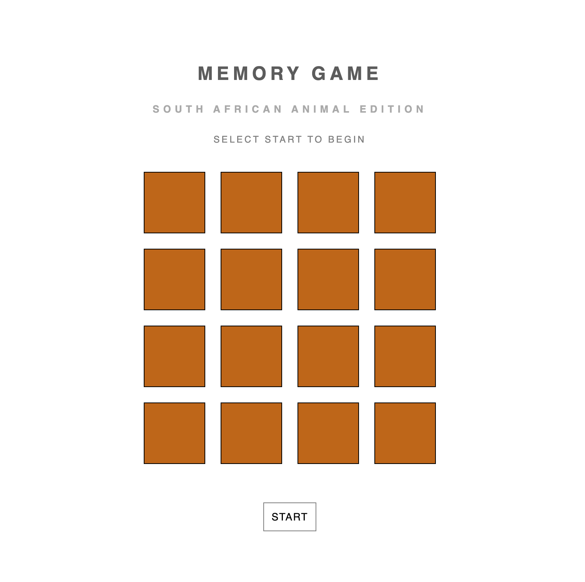
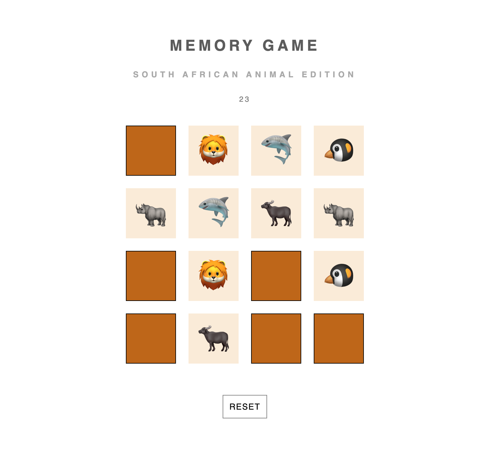
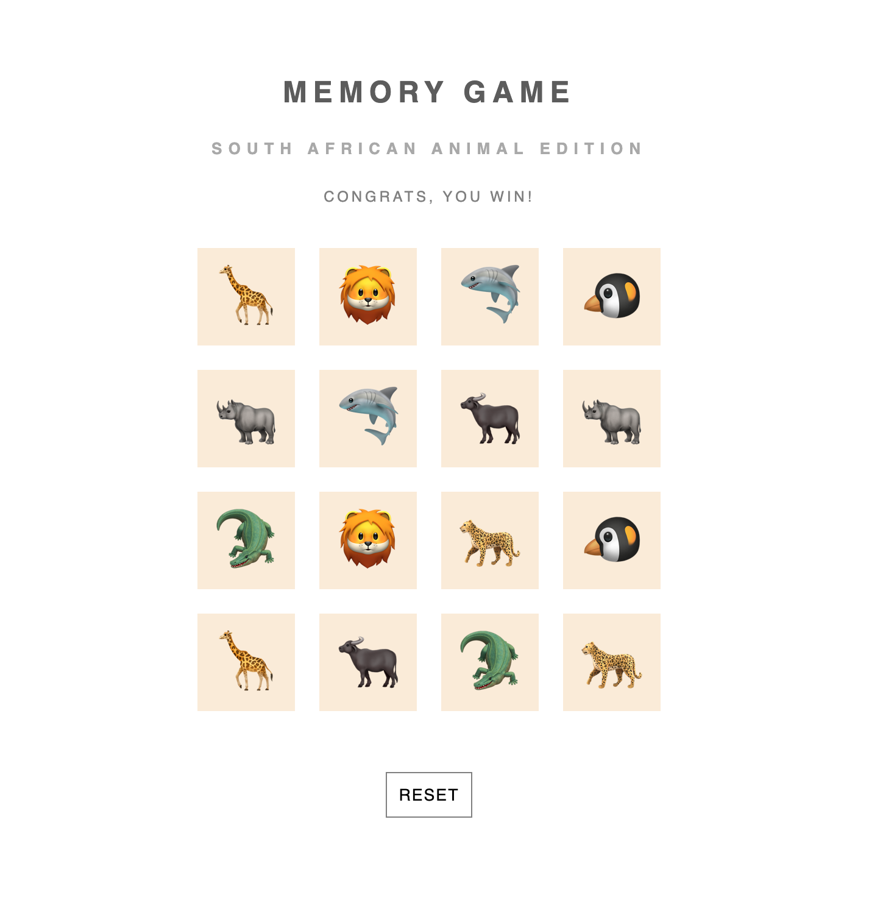
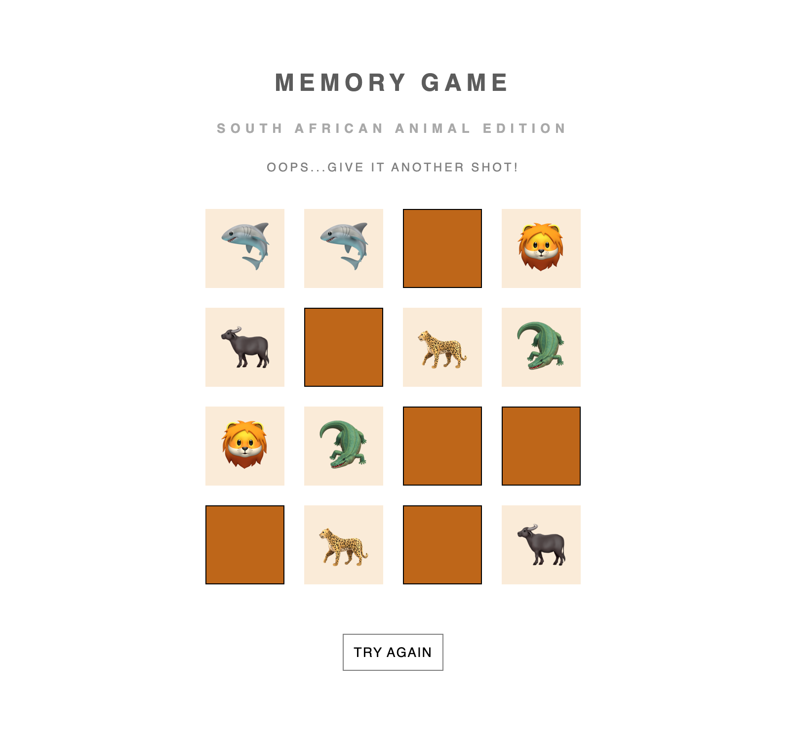

# Memory Game
### Play Memory Game
https://seanna-arnold.github.io/Memory-Game-Capstone/

I developed a traditional memory game, integrating an array of fun animal emojis. Employing the Fisher-Yates algorithm, I meticulously shuffled these elements before dynamically appending them to individual divs, emulating distinct cards within the document structure. This implementation introduces a time-sensitive challenge, wherein players must complete the task before the expiration of the timer to avoid defeat.

# Screenshots

# Technologies Used

- JavaScript
- HTML
- CSS

# Blame

- SheCodes
- W3schools
- stackoverflow
- Arjun Khara (css flip)
- Online Tutorials (css js card flip)

# Getting Started

### View Project Planning:
https://eminent-jury-c61.notion.site/Memory-Game-Project-f66ec300bf224f88bce7e2456c8ebd56

### Play Memory Game
https://seanna-arnold.github.io/Memory-Game-Capstone/

# Next Steps

- Implementing the amount of attempts made
- Utitlizing a wider range of emojis with the same amount of cards so that each game can have a different variety.
